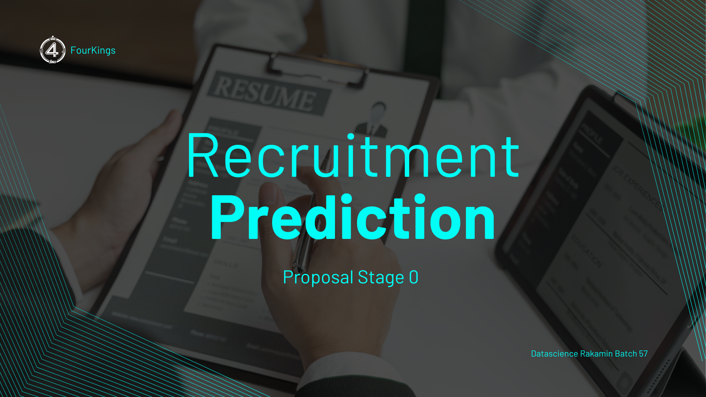

[](https://www.github.com/4Kings-Rakamin)


# Stage0_Business & DataUnderstanding


Repository ini berisi kode dan dokumentasi terkait tahap pertama dalam proses analisis data, yaitu pemahaman bisnis & pemahaman data (Data Understanding). Pada tahap ini, kita akan melakukan eksplorasi awal terhadap dataset untuk memahami struktur, kualitas, dan karakteristik data yang akan digunakan dalam analisis lebih lanjut.

Adapun Dataset yang digunakan diberikan oleh Rakamin Academy

```
https://docs.google.com/spreadsheets/d/1MiKSFqe3YV3u2iIxfc7StdMkaoBb1V0U93TeKKkvOWk/edit?gid=1139205570#gid=1139205570

```

## Problem Statement
- Proses rekrutmen menghadapi tantangan: jumlah pelamar tinggi, waktu terbatas, dan keputusan sering dipengaruhi subjektivitas.

- Analisis dataset 1.500 kandidat menunjukkan strategi agresif memiliki tingkat penerimaan tertinggi (71,7%), sedangkan moderat dan pasif hanya sekitar 14%.

- Tingginya penerimaan pada strategi agresif tidak menjamin semua kandidat layak, karena faktor lain seperti usia, pengalaman, wawancara, keterampilan, dan kepribadian juga berpengaruh.

- Kompleksitas faktor ini meningkatkan risiko salah rekrut apabila hanya mengandalkan intuisi atau proses manual.

- Penelitian ini membangun model prediksi keputusan perekrutan untuk membantu perusahaan mempercepat seleksi, mengurangi subjektivitas, dan mengoptimalkan strategi rekrutmen.

## Kesimpulan Stage_0
Berdasarkan hasil eksplorasi data yang telah dilakukan, berikut adalah beberapa kesimpulan utama yang dapat diambil:
1. **Pemilihan Dataset** : Dataset yang digunakan adalah dataset nomer 8 pada link spreadsheet diatas.
2. **Fitur numerik** seperti **InterviewScore, SkillScore, dan PersonalityScore** menunjukkan perbedaan yang signifikan antara kandidat yang diterima dan tidak diterima. Fitur-fitur ini memiliki **pengaruh yang kuat** terhadap keputusan perekrutan dan sebaiknya dipertimbangkan dalam pemodelan.
3. **Fitur kategorikal** seperti **EducationLevel dan RecruitmentStrategy** juga menunjukkan perbedaan yang signifikan dengan keputusan perekrutan. Kandidat dengan **tingkat pendidikan yang lebih tinggi** dan yang **direkrut melalui strategi agresif** cenderung memiliki **peluang lebih besar** untuk diterima.
4. **Dari total 1500 kandidat yang ada**, hanya sekitar **31%** yang diterima, menunjukkan bahwa proses perekrutan cukup selektif.
5. **Tidak ada bias signifikan** terhadap Usia dan jenis kelamin dalam proses perekrutan, dengan proporsi pria dan wanita yang diterima dan tidak diterima cukup seimbang serta rentang usia yang seimbang menandakan usia dan gender bukan faktor penentu utama dalam keputusan perekrutan. Sehingga tim perekrutan dapat dikatakan profesional dan objektif dalam menilai kandidat.
6. Fitur-fitur seperti Age, PreviousCompanies, dan DistanceFromCompany **tidak menunjukkan perbedaan yang signifikan** dengan keputusan perekrutan, sehingga mungkin kurang relevan untuk dimasukkan dalam model prediksi.
7. Berdasarkan hasil uji statistik, **fitur-fitur yang memiliki perbedaan signifikan** dengan keputusan perekrutan dapat **diprioritaskan dalam pemodelan** untuk **meningkatkan akurasi prediksi.**


## How to Run
Untuk mencoba kode dalam repository ini, ikuti langkah-langkah berikut:

```
git clone https://github.com/4Kings-Rakamin/Stage0_Business_Understanding
cd Stage0_Business_Understanding
```
Pastikan Anda memiliki Python 3.x terinstal di sistem Anda. Instal dependensi yang diperlukan dengan menjalankan:

```
pip install pandas matplotlib seaborn scipy
```

Jalankan notebook Jupyter untuk melihat hasil analisa dari masing masing dataset 8-11

## License
Repository ini dilisensikan di bawah Lisensi MIT. Lihat file [LICENSE](LICENSE) untuk detail lebih lanjut.